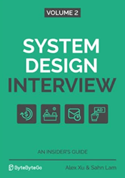

:::tip Upcoming Features
- Blogging Admin: Allow people to create their own blogpost.
- Random questions generator
- Better Computer Science interview questions
:::

Upcoming Content

### Progress Table

| Content                  | Status      |
| ------------------------ | ----------- |
| Algorithms (Algoexperts) | IN PROGRESS |
| Behavioural Answers      | IN PROGRESS |
| System design            | PENDING     |

*This is limited to this bloggers area of experitize and or interests, if you
want some specific upcoming content you can email to wangnelson2@gmail.com or
posting your own once the blogging admin feature is realeased*

- **WIP** Algorithms Interview Questions
- **WIP** Behavioural Interview Questions

Waitlist:
- System Design Interview Questions
- Data Science Interview Questions
- Cyber Security Interview Questions
- Marketing Interview Questions
- Business Case Interview Questions
- Product Management Interview Questions
- Consultancy Interview Questions
- Mechanical Engineering

## My Resources
*More like resources I am planning to use.*

| Resource                                                                                                  | Description + Update Status                                                                                                                                                                                                                                                                                                                                                                                                                                                                                                                               | Image                                      |
| --------------------------------------------------------------------------------------------------------- | --------------------------------------------------------------------------------------------------------------------------------------------------------------------------------------------------------------------------------------------------------------------------------------------------------------------------------------------------------------------------------------------------------------------------------------------------------------------------------------------------------------------------------------------------------- | ------------------------------------------ |
| Cracking the PM Interview                                                                                 | How many pizzas are delivered in Manhattan? How do you design an alarm clock for the blind? What is your favorite piece of software and why? [Amazon](https://www.amazon.com/Cracking-PM-Interview-Product-Technology/dp/0984782818/ref=sr_1_1?crid=2BU8VAI93VCFS&keywords=Cracking+the+job+interview&qid=1651515105&sprefix=cracking+the+job+interview%2Caps%2C53&sr=8-1)                                                                                                                                                                                |  |
| Algo Experts                                                                                              | **In Progress**:  [Link](https://www.algoexpert.io/)                                                                                                                                                                                                                                                                                                                                                                                                                                                                                                      |  |
| Leet Code                                                                                                 | [Leetcode.com](https://leetcode.com/)                                                                                                                                                                                                                                                                                                                                                                                                                                                                                                                     |  |
| Leet Code Patterns                                                                                        | [Leetcode Patterns](https://seanprashad.com/leetcode-patterns/)                                                                                                                                                                                                                                                                                                                                                                                                                                                                                           |  |
| Cracking the Coding Interview: 189 Programming Questions and Solutions                                    | [Amazon Link](https://www.amazon.com/Cracking-Coding-Interview-Programming-Questions/dp/0984782850/ref=sr_1_1?crid=1YWVXFLOEL07L&keywords=Cracking+the+coding+interview&qid=1651515369&sprefix=cracking+the+coding+interview%2Caps%2C43&sr=8-1)                                                                                                                                                                                                                                                                                                           |  |
| Ace the Data Science Interview: 201 Real Interview Questions Asked By FAANG, Tech Startups, & Wall Street | [Amazon Link](https://www.amazon.com/Ace-Data-Science-Interview-Questions/dp/0578973839/ref=sr_1_2_sspa?crid=1YWVXFLOEL07L&keywords=Cracking+the+coding+interview&qid=1651515369&sprefix=cracking+the+coding+interview%2Caps%2C43&sr=8-2-spons&psc=1&spLa=ZW5jcnlwdGVkUXVhbGlmaWVyPUEyNFlWNkEwSDFWNUczJmVuY3J5cHRlZElkPUEwMzUzNTU4OVNXVFZHMDhPVlNOJmVuY3J5cHRlZEFkSWQ9QTAyNTQzMTQyOTNEQzdDREtIWk5CJndpZGdldE5hbWU9c3BfYXRmJmFjdGlvbj1jbGlja1JlZGlyZWN0JmRvTm90TG9nQ2xpY2s9dHJ1ZQ==)                                                                       |  |
| System Design Interview – An insider's guide                                                              | [Amazon Link](https://www.amazon.com/System-Design-Interview-insiders-Second/dp/B08CMF2CQF/ref=sr_1_3_sspa?crid=1YWVXFLOEL07L&keywords=Cracking+the+coding+interview&qid=1651515369&sprefix=cracking+the+coding+interview%2Caps%2C43&sr=8-3-spons&psc=1&spLa=ZW5jcnlwdGVkUXVhbGlmaWVyPUEyNFlWNkEwSDFWNUczJmVuY3J5cHRlZElkPUEwMzUzNTU4OVNXVFZHMDhPVlNOJmVuY3J5cHRlZEFkSWQ9QTA5NTg1NDczRENRR0FKQUlYWkZMJndpZGdldE5hbWU9c3BfYXRmJmFjdGlvbj1jbGlja1JlZGlyZWN0JmRvTm90TG9nQ2xpY2s9dHJ1ZQ==)                                                                    |  |
| System Design Interview: Volume 2                                                                         | [Amazon Link](https://www.amazon.com/System-Design-Interview-Insiders-Guide/dp/1736049119/ref=pd_bxgy_img_sccl_1/140-1086408-0502069?pd_rd_w=7fTJ3&pf_rd_p=6b3eefea-7b16-43e9-bc45-2e332cbf99da&pf_rd_r=2YBAADHG908RR3BM4ME8&pd_rd_r=6f095d65-4414-4f03-a3af-a50596072e77&pd_rd_wg=ypKMv&pd_rd_i=1736049119&psc=1)                                                                                                                                                                                                                                        |  |
| Machine Learning Design Interview: Machine Learning System Design Interview                               | [Amazon Link](https://www.amazon.com/dp/B09YQWX59Z/ref=sspa_dk_detail_1?psc=1&pd_rd_i=B09YQWX59Z&pd_rd_w=imAB7&content-id=amzn1.sym.24b0b161-2d2e-40f8-8233-013eb186b34a&pf_rd_p=24b0b161-2d2e-40f8-8233-013eb186b34a&pf_rd_r=DF10X19F5T03321F66EJ&pd_rd_wg=vlg1X&pd_rd_r=b7723f07-0182-4e89-be97-990898f43385&s=books&spLa=ZW5jcnlwdGVkUXVhbGlmaWVyPUEyTlJHWEgyUFhZWjUmZW5jcnlwdGVkSWQ9QTA0MzI3NjIyNkI4TlhKU0JFNTM1JmVuY3J5cHRlZEFkSWQ9QTAxNDI2MTIyUlVHWFJTNENRV0RDJndpZGdldE5hbWU9c3BfZGV0YWlsJmFjdGlvbj1jbGlja1JlZGlyZWN0JmRvTm90TG9nQ2xpY2s9dHJ1ZQ==) |  |
| The Career Lab Formula: 8 Easy Steps To Get You From College To A Career In STEM                          | [Amazon Link](https://www.amazon.com/Career-Lab-Formula-Steps-College/dp/B093WJ15KC/ref=sr_1_21_sspa?crid=2V8ZB48AJUC3T&keywords=game+dev+interview&qid=1653752969&s=books&sprefix=game+dev+interview%2Cstripbooks%2C36&sr=1-21-spons&psc=1&spLa=ZW5jcnlwdGVkUXVhbGlmaWVyPUEyMjZRMFZBTFdaS1ZaJmVuY3J5cHRlZElkPUEwMjA4NDgwMVUyQjc2SVFaWlhOVyZlbmNyeXB0ZWRBZElkPUEwNjkwODIzM1BMWEhXUEhXSEJCWSZ3aWRnZXROYW1lPXNwX2J0ZiZhY3Rpb249Y2xpY2tSZWRpcmVjdCZkb05vdExvZ0NsaWNrPXRydWU=)                                                                                |  |

## Blog Content

:::caution We are also students
- Here we will just write our own opinion regarding professional ethics and all others.
:::

- Professional Ethics
- Climbing the Corporate Ladder
- Networking
- College and Clubs

