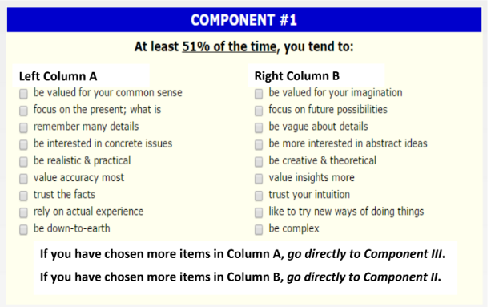
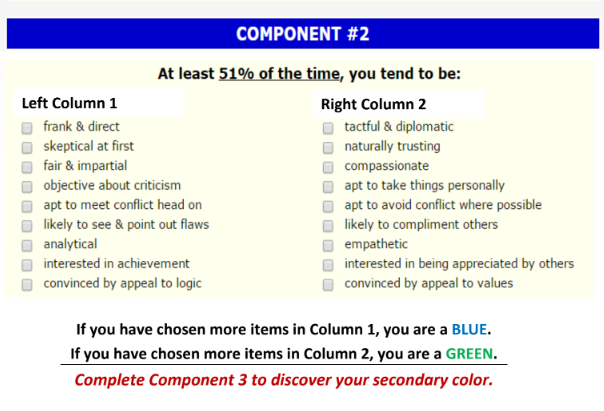
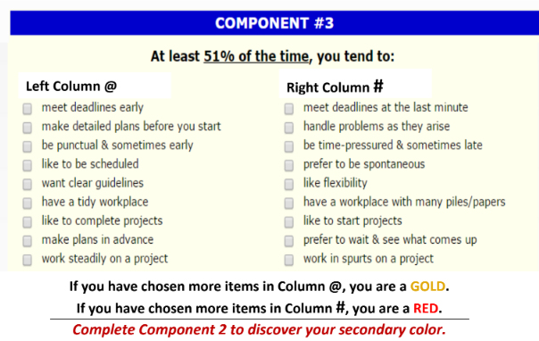
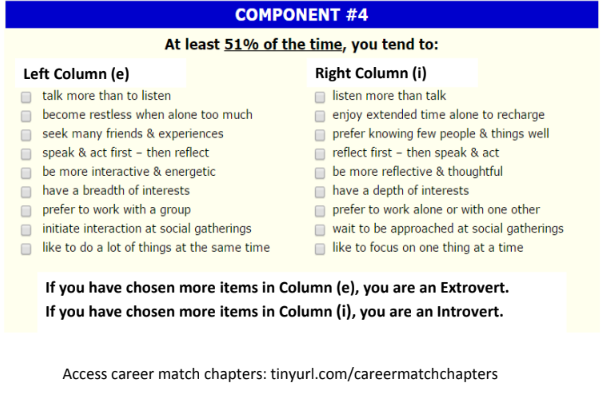

*This is a quick personality assessment *
:::tip 🔗 Links

- [ 📃 Click here for the Color Q Test as a printable file.](https://drive.google.com/file/d/1Xk32k9YWqRXAVSNjWHhq8k1nwRGriu58/view)
- [👧 **Chapters** (Results Folders)](https://tinyurl.com/careermatchchapters)

:::
<!-- 
:::caution Page in progress
- [ ] Creating Interactive Color Q
::: -->

Follow step by step: Starting by completing the following Component:

Component II

Component III

Component IV

And access the career chapter [here](https://tinyurl.com/careermatchchapters)