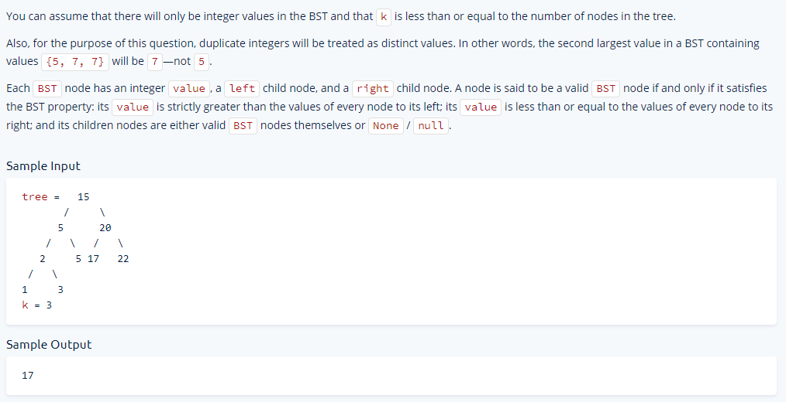
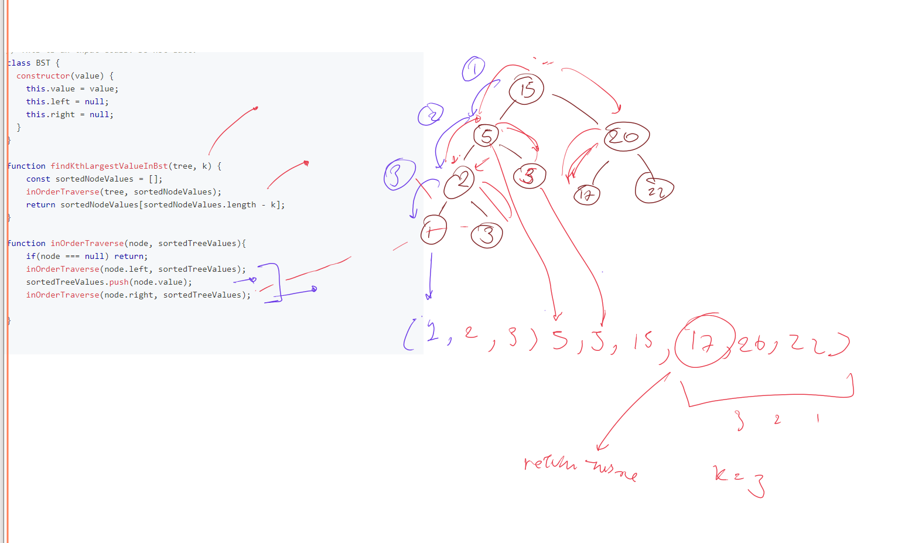
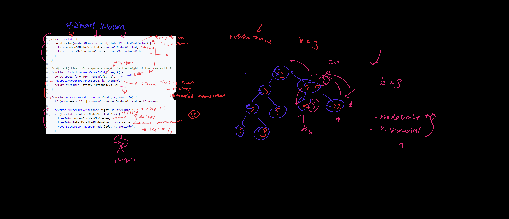

## 6- Longest Peak
Write a function that takes in an array of integers and returns the length of
the longest peak in the array.


<details>
<summary>
 Javascript Solution
</summary>

As you can see you first fit the the peak, and then start extending the peak
sides (That's whjy it starts from the left to the right. which goes increasing
or decreasing)


<div>


```javascript
function longestPeak(array) {
    let longestPeakLength = 0;
    let i = 1;

    while (i < array.length - 1) {
        const isPeak = array[i - 1] < array[i] && array[i + 1] < array[i];
        if (!isPeak) {
            i++;
            continue;
        }

        let leftIdx = i - 2;
        while (leftIdx >= 0 && array[leftIdx] < array[leftIdx + 1]) {
            leftIdx--;
        }

        let rightIdx = i + 2;
        while (rightIdx < array.length && array[rightIdx] < array[rightIdx - 1]) {
            rightIdx++;
        }

         const currentLongest = rightIdx - leftIdx - 1;
        longestPeakLength = Math.max(currentLongest, longestPeakLength);
        i = rightIdx;

    }

    return longestPeakLength;

}

```
</div>
</details>


## 7 - Array of Products
Write a function that takes in an array of integers and ran array of the same
length, where each element in the output array is equal to the product of every
other number in the input array


<details>
<summary>
 Javascript Solution
</summary>

<div>


SO this solution is actually very simple, a nested loop with a ignore case if
the i = j so it skips multiplying tiself. 


```javascript

function arrayOfProducts(array) {
    const products = [];

    for (let i = 0; i < array.length; i++) {
        let runningProduct = 1;
        for (let j = 0; j < array.length; j++) {
            if(i!==j){
                runningProduct *= array[j];
            }
            products[i] = runningProduct;
        }
    }
    return products;
}
// Do not edit the line below.
exports.arrayOfProducts = arrayOfProducts;

```

The o(n) solution is a little more interesting, this one 
o(n) solution bases on the following clue: we can get all the multiplication in
the right and the multiplications of all the values in the left we can get the
multiplication of all the values except for the one there:


```javascript
function arrayOfProducts(array){
    const products = new Array(array.length).fill(1);

    let leftRunningProduct = 1;
    for(let i=0; i<array.length; i++){
        products[i] = leftRunningProduct;
        leftRunningProduct *= array[i];
    }

    let rightRunningProduct = 1;
    for(let i=array.length -1 ; i>=0;i--){
        products[i] *= rightRunningProduct;
        rightRunningProduct *= array[i];
    }

    return products;

}
```
</div>
</details>


## 8 - First Duplicate Value
Given an array of integers between `a` and `n`, inclusive, where `n` is the
length of the array, write a function that returns the first integer that
appears more than once. (when the array is read from left to right)


<details>
<summary>
 Javascript Solution
</summary>

<div>
This happens because you can understand exclusivelly that the array perfectly matches the size of the a to n condition where the values cannot be larger than the array size.
Therefore you can use that property to maximize the effeciency.


```javascript
function firstDuplicateValue(array) {
    for (const value of array) {
        const absValue = Math.abs(value);
        if (array[absValue - 1] < 0) return absValue;
        array[absValue - 1] *= -1;

    }
    return -1;
}

```
</div>
</details>


## 9 - Merge Overlapping Intervals

Write a function that takes in a non-empty array of arbitrary intervals, merges
any overalapping intervals, and returns the new intervals in no particular order.


<details>
<summary>
 Javascript Solution
</summary>

<div>


You can see how the first interval always goes on the merge list, since her
values can be modiyied given that it is an array.

```javascript
function mergeOverlappingIntervals(intervals) {
    const sortedIntervals = intervals.sort((a, b) => a[0] - b[0]);

    const mergedIntervals = [];
    let currentInterval = sortedIntervals[0];
    mergedIntervals.push(currentInterval);

    for (const nextInterval of sortedIntervals) {
        const [_, currentIntervalEnd] = currentInterval;
        const [nextIntervalStart, nextIntervalEnd] = nextInterval;

        if(currentIntervalEnd >= nextIntervalStart) currentInterval[1] = Math.max(currentIntervalEnd, nextIntervalEnd)
        else{
            currentInterval = nextInterval;
            mergedIntervals.push(currentInterval);
        }
    }
    return mergedIntervals;
}

```
</div>
</details>


## 10 - BST Contruction
Write a BST Class that supports `insert`, `remove`, and `contains` method

<details>
<summary>
 Javascript Solution
</summary>

<div>

- You can observe how the first insertion recursively calls itself if it finds
there is a value
- Also how the contains values checks right and left and returns false, only
  when it is null. It is optimized for binary search.
- 

```javascript
class BST {
    constructor(value) {
        this.value = value;
        this.left = null;
        this.right = null;
    }

    insert(value) {
        // Write your code here.
        // Do not edit the return statement of this method.
        if (value < this.value) {
            if (this.left === null) {
                this.left = new BST(value);
            } else {
                this.left.insert(value);
            }
        } else {
            if (this.right === null) {
                this.right = new BST(value);
            } else {
                this.right.insert(value);
            }
        }


        return this;
    }

    contains(value) {
        // Write your code here.
        if (value < this.value) {
            if (this.left === null) {
                return false;
            } else {
                return this.left.contains(value);
            }
        } else if (value > this.value) {
            if (this.right === null) {
                return false;
            } else {
                return this.right.contains(value);
            }
        } else {
            return (true);
        }
    }

    remove(value, parent = null) {
        if (value < this.value) {
            if (this.left !== null) {
                this.left.remove(value, this);
            }
        } else if (value > this.value) {
            if (this.right !== null) {
                this.right.remove(value, this);
            }
        } else {
            if (this.left !== null && this.right !== null) {
                this.value = this.right.getMinValue();
                this.right.remove(this.value, this);
            } else if (parent === null) {
                if (this.left !== null) {
                    this.value = this.left.value;
                    this.right = this.left.right;
                    this.left = this.left.left;
                } else if (this.right !== null) {
                    this.value = this.right.value;
                    this.left = this.right.left;
                    this.right = this.right.right;
                } else {
                    
                }
            } else if (parent.left === this) {
                parent.left = this.left !== null ? this.left : this.right;
            } else if (parent.right === this) {
                parent.right = this.left !== null ? this.left : this.right;
            }
        }
        return this;
    }

    getMinValue() {
        if (this.left == null) {
            return this.value;
        } else {
            return this.left.getMinValue();
        }
    }
}

// Do not edit the line below.
exports.BST = BST;

```
</div>
</details>

## 11 - Validate BST
Write a function that takes in a potentially invalid Binary Search Tree (BST)
and returns a boolean representing whther the BST is valid.

<details>
<summary>
 Javascript Solution
</summary>

<div>

This is just about keep evaluating down the tree


```javascript
class BST {
    constructor(value) {
        this.value = value;
        this.left = null;
        this.right = null;
    }
}

function validateBst(tree) {
    // Write your code here.
    return validateBstHelper(tree, -Infinity, Infinity);
}


function validateBstHelper(tree, minValue, maxValue) {
    if (tree === null) return true;
    if (tree.value < minValue || tree.value >= maxValue) return false;
    const leftIsValid = validateBstHelper(tree.left, minValue, tree.value);
    return leftIsValid && validateBstHelper(tree.right, tree.value, maxValue);


}
```
</div>
</details>


## 12 - BST Traversal
Write three functions that take in a Binary Search Tree (BST) and an empty
array, traverse the BST, add its nodes' values to the input array, and returns
that array. The three functions should traverse the BST using the in-order,
pre-order, and post-order tree-traversal techniques, respectively.


<details>
<summary>
 Javascript Solution
</summary>

<div>

You can see here how the pre, post, in order traversals affect them.


```javascript
function inOrderTraverse(tree, array) {
    // Write your code here.
    if (tree !== null) {
        inOrderTraverse(tree.left, array);
        array.push(tree.value);
        inOrderTraverse(tree.right, array);
    }
    return array;

}

function preOrderTraverse(tree, array) {
    // Write your code here.
    if (tree !== null) {
        array.push(tree.value);
        preOrderTraverse(tree.left, array);
        preOrderTraverse(tree.right, array);

    }
    return array;
}

function postOrderTraverse(tree, array) {
    // Write your code here.
    if (tree !== null) {
        postOrderTraverse(tree.left, array);
        postOrderTraverse(tree.right, array);
        array.push(tree.value);
    }
    return array;
}
```
</div>
</details>

## 13 - Min Height BST
Write a function that takes in a non-empty sorted array of distinct integers,
contructs a BST from the integers, and returns the root of the BST


Starter Code

```javascript
function minHeightBst(array) {
  // Write your code here.
}

class BST {
  constructor(value) {
    this.value = value;
    this.left = null;
    this.right = null;
  }

  insert(value) {
    if (value < this.value) {
      if (this.left === null) {
        this.left = new BST(value);
      } else {
        this.left.insert(value);
      }
    } else {
      if (this.right === null) {
        this.right = new BST(value);
      } else {
        this.right.insert(value);
      }
    }
  }
}

// Do not edit the line below.
exports.minHeightBst = minHeightBst;


```

https://replit.com/join/ffpqgpxtqr-nenewang

https://www.algoexpert.io/questions/min-height-bst


<details>
<summary>
 Javascript Solution
</summary>
<div>

<iframe width="380" height="420" src="https://www.youtube.com/embed/FM3KSLJb1BY" title="YouTube video player" frameborder="0" allow="accelerometer; autoplay; clipboard-write; encrypted-media; gyroscope; picture-in-picture" allowfullscreen="true"></iframe>


```javascript
function minHeightBst(array) {
    // Write your code here.
    return constructMinHeightBst(array, null, 0, array.length - 1);
}

function constructMinHeightBst(array, bst, startIdx, endIdx) {
    if (endIdx < startIdx) return;
    const midIdx = Math.floor((startIdx + endIdx) / 2);
    const valueToAdd = array[midIdx];
    if (bst === null) {
        bst = new BST(valueToAdd);
    } else {
        bst.insert(valueToAdd);
    }

    constructMinHeightBst(array, bst, startIdx, midIdx - 1);
    constructMinHeightBst(array, bst, midIdx + 1, endIdx);
    return bst;
}

class BST {
  constructor(value) {
    this.value = value;
    this.left = null;
    this.right = null;
  }

  insert(value) {
    if (value < this.value) {
      if (this.left === null) {
        this.left = new BST(value);
      } else {
        this.left.insert(value);
      }
    } else {
      if (this.right === null) {
        this.right = new BST(value);
      } else {
        this.right.insert(value);
      }
    }
  }
}

```
</div>
</details>


## 14 - Find Kth Largest Value in BST

[👀 Algo Experts Link](https://www.algoexpert.io/questions/Find%20Kth%20Largest%20Value%20In%20BST)

Write a function that takes in a Binary Search Tree (BST) and a positive integer `k` and returns the kth largest integer contained in the BST.



**Starter Code**
```js
// This is an input class. Do not edit.
class BST {
  constructor(value) {
    this.value = value;
    this.left = null;
    this.right = null;
  }
}

function findKthLargestValueInBst(tree, k) {
  // Write your code here.
  return -1;
}


```


<details>
<summary>
 Javascript Solution (Naive)
</summary>



<div>

<iframe width="380" height="420" src="https://www.youtube.com/embed/iG2ggO7S664" title="YouTube video player" frameborder="0" allow="accelerometer; autoplay; clipboard-write; encrypted-media; gyroscope; picture-in-picture" allowfullscreen="true"></iframe>


```javascript
// This is an input class. Do not edit.
class BST {
  constructor(value) {
    this.value = value;
    this.left = null;
    this.right = null;
  }
}

function findKthLargestValueInBst(tree, k) {
    const sortedNodeValues = [];
    inOrderTraverse(tree, sortedNodeValues);
    return sortedNodeValues[sortedNodeValues.length - k];
}

function inOrderTraverse(node, sortedTreeValues){
    if(node === null) return;
    inOrderTraverse(node.left, sortedTreeValues);
    sortedTreeValues.push(node.value);
    inOrderTraverse(node.right, sortedTreeValues);
    
}


```
</div>
</details>


<details>
<summary>
 Javascript Solution (Efficient)
</summary>



<div>

<iframe width="380" height="420" src="https://www.youtube.com/embed/HOwNahYf9og" title="YouTube video player" frameborder="0" allow="accelerometer; autoplay; clipboard-write; encrypted-media; gyroscope; picture-in-picture" allowfullscreen="true"></iframe>


```javascript
// This is an input class. Do not edit.// This is an input class. Do not edit.
class BST {
  constructor(value) {
    this.value = value;
    this.left = null;
    this.right = null;
  }
}

class TreeInfo{

  constructor(travesalN, lastNode){
    this.travesalN = travesalN;
    this.lastNode = lastNode;
  }
  
}

function findKthLargestValueInBst(tree, k) {
  const treeInfo = new TreeInfo(0, -1)
  reverseOrderTravesal(tree, treeInfo, k)
  return treeInfo.lastNode;
}


function reverseOrderTravesal(node, treeInfo, k){
  if(node==null || treeInfo.travesalN >= k){
    return
  }
  // right
  reverseOrderTravesal(node.right, treeInfo, k)
  // Do something
  if(treeInfo.travesalN < k){
    treeInfo.travesalN++
    treeInfo.lastNode = node.value
  }
  
  // Left
  reverseOrderTravesal(node.left, treeInfo, k)
}


```
</div>
</details>


## 15 -  Reconstruct BST
The pre-order traversal of a Binary Tree is a traversal technique that starts at the tree's root node and visits nodes in the following order:

1. Current node
2. Left subtree
3. Right subtree


**Starter Code**

```js
// This is an input class. Do not edit.
class BST {
  constructor(value, left = null, right = null) {
    this.value = value;
    this.left = left;
    this.right = right;
  }
}

function reconstructBst(preOrderTraversalValues) {
  // Write your code here.
  return null;
}

```

<details>
<summary>
 👨‍🔬 Javascript Solution
</summary>

<div>


<iframe width="380" height="420" src="https://www.youtube.com/embed/9kDaGmTZhVI" title="YouTube video player" frameborder="0" allow="accelerometer; autoplay; clipboard-write; encrypted-media; gyroscope; picture-in-picture" allowfullscreen="true"></iframe>

```javascript
// This is an input class. Do not edit.
// This is an input class. Do not edit.
class BST {
  constructor(value, left = null, right = null) {
    this.value = value;
    this.left = left;
    this.right = right;
  }
}

function reconstructBst(preOrderTraversalValues) {

    if (preOrderTraversalValues.length === 0) return null;

    const currentValue = preOrderTraversalValues[0];
    let rightSubtreeRootIdx = preOrderTraversalValues.length;

    for (let idx = 1; idx < preOrderTraversalValues.length; idx++) {
        const value = preOrderTraversalValues[idx];
        if (value >= currentValue) {
            rightSubtreeRootIdx = idx;
            break;
        }
    }
    const leftSubtree = reconstructBst(preOrderTraversalValues.slice(1, rightSubtreeRootIdx));
    const rightSubtree = reconstructBst(preOrderTraversalValues.slice(rightSubtreeRootIdx));
    return new BST(currentValue, leftSubtree, rightSubtree);
}

```
</div>
</details>


