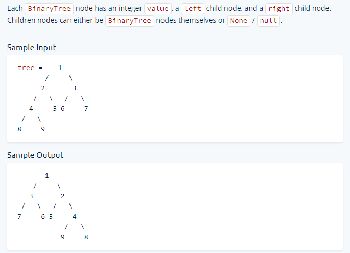

## 11 -  Invert Binary Tree

Write a function that takes in a Binary Tree and inverts it. In other words, the function should swap every left node in the tree for its corresponding right node.




**Starter Code**

```js
function invertBinaryTree(tree) {
  // Write your code here.
}

// This is the class of the input binary tree.
class BinaryTree {
  constructor(value) {
    this.value = value;
    this.left = null;
    this.right = null;
  }
}

```

<details>
<summary>
 👨‍🔬 Javascript Solution
</summary>

<div>


<iframe width="380" height="420" src="https://www.youtube.com/embed/9kDaGmTZhVI" title="YouTube video player" frameborder="0" allow="accelerometer; autoplay; clipboard-write; encrypted-media; gyroscope; picture-in-picture" allowfullscreen="true"></iframe>

```javascript

function invertBinaryTree(tree) {
    // Write your code here.
    const queue = [tree];
    while (queue.length) {
        const current = queue.shift();
        if (current === null) continue;
        swapLeftAndRight(current);
        queue.push(current.left);
        queue.push(current.right);
    }


}

function swapLeftAndRight(tree) {
    const left = tree.left;
    tree.left = tree.right;
    tree.right = left;
}
}

```
</div>
</details>


## 11 -  Reconstruct
Description


**Starter Code**

```js
starter Code

```

<details>
<summary>
 👨‍🔬 Javascript Solution
</summary>

<div>


<iframe width="380" height="420" src="https://www.youtube.com/embed/9kDaGmTZhVI" title="YouTube video player" frameborder="0" allow="accelerometer; autoplay; clipboard-write; encrypted-media; gyroscope; picture-in-picture" allowfullscreen="true"></iframe>

```javascript
Solution Code
}

```
</div>
</details>


## 12 -  Reconstruct
Description


**Starter Code**

```js
starter Code

```

<details>
<summary>
 👨‍🔬 Javascript Solution
</summary>

<div>


<iframe width="380" height="420" src="https://www.youtube.com/embed/9kDaGmTZhVI" title="YouTube video player" frameborder="0" allow="accelerometer; autoplay; clipboard-write; encrypted-media; gyroscope; picture-in-picture" allowfullscreen="true"></iframe>

```javascript
Solution Code
}

```
</div>
</details>


## 13 -  Reconstruct
Description


**Starter Code**

```js
starter Code

```

<details>
<summary>
 👨‍🔬 Javascript Solution
</summary>

<div>


<iframe width="380" height="420" src="https://www.youtube.com/embed/9kDaGmTZhVI" title="YouTube video player" frameborder="0" allow="accelerometer; autoplay; clipboard-write; encrypted-media; gyroscope; picture-in-picture" allowfullscreen="true"></iframe>

```javascript
Solution Code
}

```
</div>
</details>


## 14 -  Reconstruct
Description


**Starter Code**

```js
starter Code

```

<details>
<summary>
 👨‍🔬 Javascript Solution
</summary>

<div>


<iframe width="380" height="420" src="https://www.youtube.com/embed/9kDaGmTZhVI" title="YouTube video player" frameborder="0" allow="accelerometer; autoplay; clipboard-write; encrypted-media; gyroscope; picture-in-picture" allowfullscreen="true"></iframe>

```javascript
Solution Code
}

```
</div>
</details>


## 15 -  Reconstruct
Description


**Starter Code**

```js
starter Code

```

<details>
<summary>
 👨‍🔬 Javascript Solution
</summary>

<div>


<iframe width="380" height="420" src="https://www.youtube.com/embed/9kDaGmTZhVI" title="YouTube video player" frameborder="0" allow="accelerometer; autoplay; clipboard-write; encrypted-media; gyroscope; picture-in-picture" allowfullscreen="true"></iframe>

```javascript
Solution Code
}

```
</div>
</details>


## 16 -  Reconstruct
Description


**Starter Code**

```js
starter Code

```

<details>
<summary>
 👨‍🔬 Javascript Solution
</summary>

<div>


<iframe width="380" height="420" src="https://www.youtube.com/embed/9kDaGmTZhVI" title="YouTube video player" frameborder="0" allow="accelerometer; autoplay; clipboard-write; encrypted-media; gyroscope; picture-in-picture" allowfullscreen="true"></iframe>

```javascript
Solution Code
}

```
</div>
</details>


## 17 -  Reconstruct
Description


**Starter Code**

```js
starter Code

```

<details>
<summary>
 👨‍🔬 Javascript Solution
</summary>

<div>


<iframe width="380" height="420" src="https://www.youtube.com/embed/9kDaGmTZhVI" title="YouTube video player" frameborder="0" allow="accelerometer; autoplay; clipboard-write; encrypted-media; gyroscope; picture-in-picture" allowfullscreen="true"></iframe>

```javascript
Solution Code
}

```
</div>
</details>


## 18 -  Reconstruct
Description


**Starter Code**

```js
starter Code

```

<details>
<summary>
 👨‍🔬 Javascript Solution
</summary>

<div>


<iframe width="380" height="420" src="https://www.youtube.com/embed/9kDaGmTZhVI" title="YouTube video player" frameborder="0" allow="accelerometer; autoplay; clipboard-write; encrypted-media; gyroscope; picture-in-picture" allowfullscreen="true"></iframe>

```javascript
Solution Code
}

```
</div>
</details>


## 19 -  Reconstruct
Description


**Starter Code**

```js
starter Code

```

<details>
<summary>
 👨‍🔬 Javascript Solution
</summary>

<div>


<iframe width="380" height="420" src="https://www.youtube.com/embed/9kDaGmTZhVI" title="YouTube video player" frameborder="0" allow="accelerometer; autoplay; clipboard-write; encrypted-media; gyroscope; picture-in-picture" allowfullscreen="true"></iframe>

```javascript
Solution Code
}

```
</div>
</details>


## 20 -  Reconstruct
Description


**Starter Code**

```js
starter Code

```

<details>
<summary>
 👨‍🔬 Javascript Solution
</summary>

<div>


<iframe width="380" height="420" src="https://www.youtube.com/embed/9kDaGmTZhVI" title="YouTube video player" frameborder="0" allow="accelerometer; autoplay; clipboard-write; encrypted-media; gyroscope; picture-in-picture" allowfullscreen="true"></iframe>

```javascript
Solution Code
}

```
</div>
</details>

