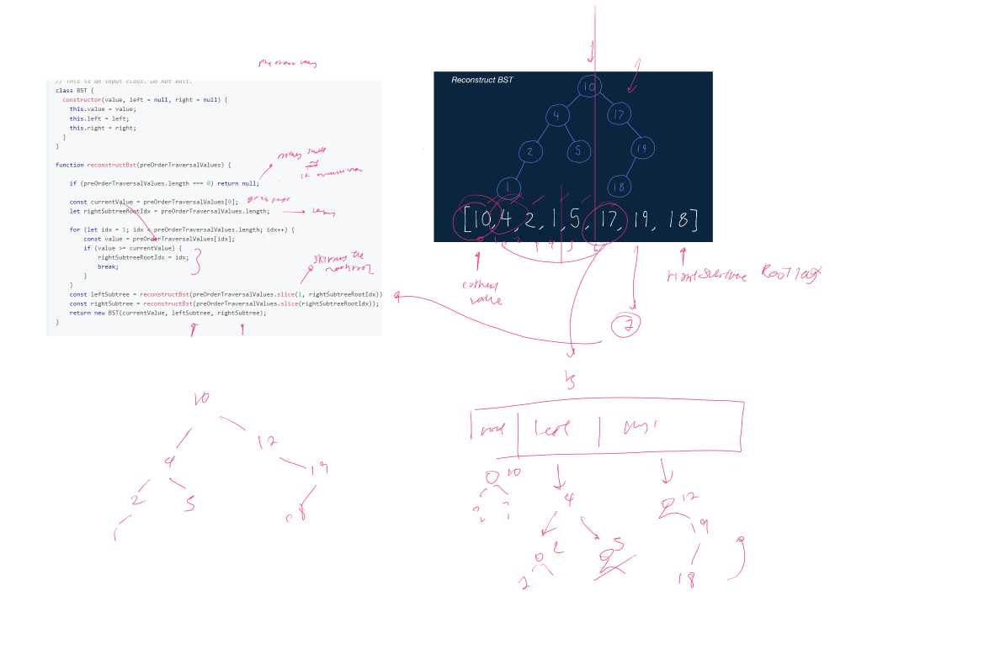

## 16 -  Invert Binary Tree

Write a function that takes in a Binary Tree and inverts it. In other words, the function should swap every left node in the tree for its corresponding right node.


**Starter Code**

```js
function invertBinaryTree(tree) {
  // Write your code here.
}

// This is the class of the input binary tree.
class BinaryTree {
  constructor(value) {
    this.value = value;
    this.left = null;
    this.right = null;
  }
}

```

<details>
<summary>
 👨‍🔬 Javascript Solution
</summary>

<div>


<iframe width="380" height="420" src="https://www.youtube.com/embed/pqWXSxn-4oM" title="YouTube video player" frameborder="0" allow="accelerometer; autoplay; clipboard-write; encrypted-media; gyroscope; picture-in-picture" allowfullscreen="true"></iframe>

```javascript

function invertBinaryTree(tree) {
    // Write your code here.
    const queue = [tree];
    while (queue.length) {
        const current = queue.shift();
        if (current === null) continue;
        swapLeftAndRight(current);
        queue.push(current.left);
        queue.push(current.right);
    }


}

function swapLeftAndRight(tree) {
    const left = tree.left;
    tree.left = tree.right;
    tree.right = left;
}
}

```
</div>
</details>


## 17 -  Binary Tree Diameter

Write a function that takes in a Binary Tree and returns its diameter. The diameter of a binary tree is defined as the length of its longest path, even if that path doesn't pass through the root of the tree.


**Starter Code**

```js
// This is an input class. Do not edit.
class BinaryTree {
  constructor(value) {
    this.value = value;
    this.left = null;
    this.right = null;
  }
}

function binaryTreeDiameter(tree) {
  // Write your code here.
  return -1;
}

```

<details>
<summary>
 👨‍🔬 Javascript Solution
</summary>

<div>




<iframe width="380" height="420" src="https://www.youtube.com/embed/9kDaGmTZhVI" title="YouTube video player" frameborder="0" allow="accelerometer; autoplay; clipboard-write; encrypted-media; gyroscope; picture-in-picture" allowfullscreen="true"></iframe>

```javascript
Solution Code
}

```
</div>
</details>


## 17b -  Find Successor
Write a fucntion that takes in a Binary Tree ( Where nodes have an additional pointer to their parend node) as welll as a node contained in that tree and return the given node's successor.


**Starter Code**

```js
// This is an input class. Do not edit.
class BinaryTree {
  constructor(value) {
    this.value = value;
    this.left = null;
    this.right = null;
    this.parent = null;
  }
}

function findSuccessor(tree, node) {
  // Write your code here.
  return null;
}

```

<details>
<summary>
 👨‍🔬 Javascript Solution
</summary>

<div>


<iframe width="380" height="420" src="https://www.youtube.com/embed/9kDaGmTZhVI" title="YouTube video player" frameborder="0" allow="accelerometer; autoplay; clipboard-write; encrypted-media; gyroscope; picture-in-picture" allowfullscreen="true"></iframe>

```javascript
class BinaryTree {
    constructor(value) {
        this.value = value;
        this.left = null;
        this.right = null;
        this.parent = null;
    }
}

function findSuccessor(tree, node) {
    const inOrderTraversalOrder = getInOrderTraversalOrder(tree);

    for (let idx = 0; idx < inOrderTraversalOrder.length; idx++) {
        const currentNode = inOrderTraversalOrder[idx];
        if (currentNode !== node) continue;

        if (idx === inOrderTraversalOrder.length - 1) return null;

        return inOrderTraversalOrder[idx + 1];
    }
}

function getInOrderTraversalOrder(node, order = []) {
    if (node === null) return order;
    getInOrderTraversalOrder(node.left, order);
    order.push(node);
    getInOrderTraversalOrder(node.right, order);

    return order;
}
```
</div>
</details>

<details>

<summary>
Advanced Solution
</summary>

```js

function findSuccessor(tree, node) {
    if (node.right !== null) return getLeftMostChild(node.right);
    return getRightMostParent(node);
}


function getLeftMostChild(node){
    let currentNode = node;
    while(currentNode.left !== null){
        currentNode = currentNode.left;
    }

    return currentNode;
}

function getRightMostParent(node) {
    let currentNode = node;
    while (currentNode.parent !== null && currentNode.parent.right == currentNode) {
        currentNode = currentNode.parent;
    }
    return currentNode.parent;
}

```

</details>


## 18 -  Height Balanced Binary Tree

You're given the root node of a Binary Tree. Write a function that returns `true` if this Binary Tree is height balanced and `false` if it isn't


**Starter Code**

```js
// This is an input class. Do not edit.
class BinaryTree {
  constructor(value) {
    this.value = value;
    this.left = null;
    this.right = null;
  }
}

function heightBalancedBinaryTree(tree) {
  // Write your code here.
  return false;
}

// Do not edit the lines below.
exports.BinaryTree = BinaryTree;
exports.heightBalancedBinaryTree = heightBalancedBinaryTree;


```

<details>
<summary>
 👨‍🔬 Javascript Solution
</summary>

<div>


<iframe width="380" height="420" src="https://www.youtube.com/embed/ofSsDWpqfZo" title="YouTube video player" frameborder="0" allow="accelerometer; autoplay; clipboard-write; encrypted-media; gyroscope; picture-in-picture" allowfullscreen="true"></iframe>

```javascript
class BinaryTree {
    constructor(value) {
        this.value = value;
        this.left = null;
        this.right = null;
    }
}

class TreeInfo {
    constructor(isBalanced, height) {
        this.isBalanced = isBalanced;
        this.height = height;
    }
}

function heightBalancedBinaryTree(tree) {
    const treeInfo = getTreeInfo(tree);
    return treeInfo.isBalanced;
}

function getTreeInfo(node) {
    if (node === null) return new TreeInfo(true, -1);
    const leftSubtreeInfo = getTreeInfo(node.left);
    const rightSubtreeInfo = getTreeInfo(node.right);

    const isBalanced = leftSubtreeInfo.isBalanced && rightSubtreeInfo.isBalanced && Math.abs(leftSubtreeInfo.height - rightSubtreeInfo.height) <=1;
	const height = Math.max(leftSubtreeInfo.height, rightSubtreeInfo.height) + 1;
    return new TreeInfo(isBalanced, height);

}
// Do not edit the lines below.
exports.BinaryTree = BinaryTree;
exports.heightBalancedBinaryTree = heightBalancedBinaryTree;

}

```
</div>
</details>


## 19 -  Max Subset Sum No Adjacent

Write a function that takes in an array of positive integers and returns the maximum sum of non-adjacent elements in the array.


**Starter Code**

```js

function maxSubsetSumNoAdjacent(array) {
  // Write your code here.
}

```

<details>
<summary>
 👨‍🔬 Javascript Solution
</summary>

<div>


<iframe width="380" height="420" src="https://www.youtube.com/embed/9kDaGmTZhVI" title="YouTube video player" frameborder="0" allow="accelerometer; autoplay; clipboard-write; encrypted-media; gyroscope; picture-in-picture" allowfullscreen="true"></iframe>

```javascript
function maxSubsetSumNoAdjacent(array) {
    if (!array.length) return 0;
    if (array.length === 1) return array[0];

    const maxSums = array.slice();
    maxSums[1] = Math.max(array[0], array[1]);
    for (let i = 2; i < array.length; i++) {
        maxSums[i] = Math.max(maxSums[i - 1], maxSums[i - 2] + array[i]);
    }
    return maxSums[maxSums.length - 1];
}


```
</div>
</details>


## 20 -  Number of Ways to Make Change

Given an array of distinc positive integers representing coin denominations and a single non-negative integer `n` representing a target amount of money, write a function that returns the number of ways to make change for that target amount using hte given coin denominations.
- Note that an unlimited amount of coins is at your disposal


**Starter Code**

```js

function numberOfWaysToMakeChange(n, denoms) {
  // Write your code here.
}


```

<details>
<summary>
 👨‍🔬 Javascript Solution
</summary>

<div>


<iframe width="380" height="420" src="https://www.youtube.com/embed/mSCleaTGP2Q" title="YouTube video player" frameborder="0" allow="accelerometer; autoplay; clipboard-write; encrypted-media; gyroscope; picture-in-picture" allowfullscreen="true"></iframe>

```javascript

function numberOfWaysToMakeChange(n, denoms) {
    const ways = new Array(n + 1).fill(0);
    ways[0] = 1;
    for (let denom of denoms) {
        for (let amount = 1; amount < n + 1; amount++) {
            if (denom <= amount) ways[amount] += ways[amount - denom];
        }
    }
    return ways[n];

}

}

```
</div>
</details>


## 21 -  Min Number of Coins for Change

Given an Array of Positive single non-negative integer `n` representing a target amount of money, wirte a function...


**Starter Code**

```js
starter Code

```

<details>
<summary>
 👨‍🔬 Javascript Solution
</summary>

<div>


<iframe width="380" height="420" src="https://www.youtube.com/embed/9kDaGmTZhVI" title="YouTube video player" frameborder="0" allow="accelerometer; autoplay; clipboard-write; encrypted-media; gyroscope; picture-in-picture" allowfullscreen="true"></iframe>

```javascript
Solution Code
}

```
</div>
</details>


## 22 -  Levenshtein Distance

Write a function that takes in two strings and returns the minimum number of edit operations that need to be performed on the first string to obtain the second string.

There are three edit operations: 
- Insertion fo a character
- Deletion of a character
- Substitution of a character


**Starter Code**

```js


function levenshteinDistance(str1, str2) {

}


```

<details>
<summary>
 👨‍🔬 Javascript Solution
</summary>

<div>

- We can create a table to compare which is the distance between them


<iframe width="380" height="420" src="https://www.youtube.com/embed/9kDaGmTZhVI" title="YouTube video player" frameborder="0" allow="accelerometer; autoplay; clipboard-write; encrypted-media; gyroscope; picture-in-picture" allowfullscreen="true"></iframe>

```javascript

function levenshteinDistance(str1, str2) {
    const edits = [];
    for (let i = 0; i < str2.length + 1; i++) {
        const row = [];
        for (let j = 0; j < str1.length + 1; j++) {
            row.push(j);
        }

        row[0] = i;
        edits.push(row);
    }

    for (let i = 1; i < str2.length + 1; i++) {
        for (let j = 1; j < str1.length + 1; j++) {
            if (str2[i - 1] === str1[j - 1]) {
                edits[i][j] = edits[i - 1][j - 1];
            } else {
                edits[i][j] = 1 + Math.min(edits[i - 1][j - 1], edits[i - 1][j], edits[i][j - 1]);
            }
        }
    }
    return edits[str2.length][str1.length];

}

// Do not edit the line below.
exports.levenshteinDistance = levenshteinDistance;

```
</div>
</details>


## 23 -  Kadane's Algorithm
Description


**Starter Code**

```js
starter Code

```

<details>
<summary>
 👨‍🔬 Javascript Solution
</summary>

<div>


<iframe width="380" height="420" src="https://www.youtube.com/embed/9kDaGmTZhVI" title="YouTube video player" frameborder="0" allow="accelerometer; autoplay; clipboard-write; encrypted-media; gyroscope; picture-in-picture" allowfullscreen="true"></iframe>

```javascript
Solution Code
}

```
</div>
</details>


## 24 -  Single Cycle Check
Description


**Starter Code**

```js
starter Code

```

<details>
<summary>
 👨‍🔬 Javascript Solution
</summary>

<div>


<iframe width="380" height="420" src="https://www.youtube.com/embed/9kDaGmTZhVI" title="YouTube video player" frameborder="0" allow="accelerometer; autoplay; clipboard-write; encrypted-media; gyroscope; picture-in-picture" allowfullscreen="true"></iframe>

```javascript
Solution Code
}

```
</div>
</details>

