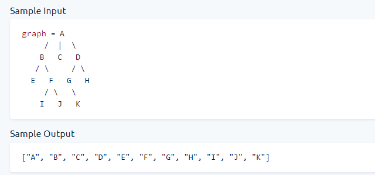

- 25	Breadth First Search
- 26	Youngest Common Ancestor
- 27	Remove Islands
- 28	Cycle In Graph
- 29	Minimum Passes of Matrix
- 30	Task Assignment
- 31	Valid Starting City
- 32	Min Heap Construction
- 33	Linked List Construction
- 34	Remove Kth Node From End
- 35	Sum of Linked Lists


## 25	Breadth First Search

You're given a `Node` class that has a `name` and an array of optional `children` nodex. When put together, nodes form an acyclic tree-like structure

Implement the `breathFirstSearch` method on the `Node` class, which takes in an empty array, traverses the tree using the Breadth-first Search approach (specifically navigating the tree form left to right), stores all of the nodes' names in the input array, and returns it.




```js title="Starter code"
class Node {
  constructor(name) {
    this.name = name;
    this.children = [];
  }

  addChild(name) {
    this.children.push(new Node(name));
    return this;
  }

  breadthFirstSearch(array) {
    // Write your code here.
  }
}
```

<details>
<summary>
 👨‍🔬 Solutions
</summary>

<Tabs>
  <TabItem value="js" label="Js">

```js
function status() {
  console.log("On Development - Coming Soon!");
}
```

  </TabItem>

  <TabItem value="py" label="Py">

```py
def status():
    print("On Development - Coming Soon using Python!")

```

  </TabItem>
  <TabItem value="java" label="Java">

```java
class HelloWorld {
    public static void main(String[] args) {
        System.out.println("On Development - Coming Soon using Java!"); 
    }
}

```

  </TabItem>

  <TabItem value="c++" label="C++">

```cpp
#include <iostream>

int main() {
    std::cout << "On Development - Coming Soon using C++!";
    return 0;
}
```

  </TabItem>
  
</Tabs>

</details>

## 26	Youngest Common Ancestor


```js title="Starter code"
function numberOfWaysToTraverseGraph(width, height) {
  return 0;
}
```

<details>
<summary>
 👨‍🔬 Solutions
</summary>

<Tabs>
  <TabItem value="js" label="Js">

```js
function status() {
  console.log("On Development - Coming Soon!");
}
```

  </TabItem>

  <TabItem value="py" label="Py">

```py
def status():
    print("On Development - Coming Soon using Python!")

```

  </TabItem>
  <TabItem value="java" label="Java">

```java
class HelloWorld {
    public static void main(String[] args) {
        System.out.println("On Development - Coming Soon using Java!"); 
    }
}

```

  </TabItem>

  <TabItem value="c++" label="C++">

```cpp
#include <iostream>

int main() {
    std::cout << "On Development - Coming Soon using C++!";
    return 0;
}
```

  </TabItem>
  
</Tabs>

</details>

## 27	Remove Islands


```js title="Starter code"
function numberOfWaysToTraverseGraph(width, height) {
  return 0;
}
```

<details>
<summary>
 👨‍🔬 Solutions
</summary>

<Tabs>
  <TabItem value="js" label="Js">

```js
function status() {
  console.log("On Development - Coming Soon!");
}
```

  </TabItem>

  <TabItem value="py" label="Py">

```py
def status():
    print("On Development - Coming Soon using Python!")

```

  </TabItem>
  <TabItem value="java" label="Java">

```java
class HelloWorld {
    public static void main(String[] args) {
        System.out.println("On Development - Coming Soon using Java!"); 
    }
}

```

  </TabItem>

  <TabItem value="c++" label="C++">

```cpp
#include <iostream>

int main() {
    std::cout << "On Development - Coming Soon using C++!";
    return 0;
}
```

  </TabItem>
  
</Tabs>

</details>

## 28	Cycle In Graph


```js title="Starter code"
function numberOfWaysToTraverseGraph(width, height) {
  return 0;
}
```

<details>
<summary>
 👨‍🔬 Solutions
</summary>

<Tabs>
  <TabItem value="js" label="Js">

```js
function status() {
  console.log("On Development - Coming Soon!");
}
```

  </TabItem>

  <TabItem value="py" label="Py">

```py
def status():
    print("On Development - Coming Soon using Python!")

```

  </TabItem>
  <TabItem value="java" label="Java">

```java
class HelloWorld {
    public static void main(String[] args) {
        System.out.println("On Development - Coming Soon using Java!"); 
    }
}

```

  </TabItem>

  <TabItem value="c++" label="C++">

```cpp
#include <iostream>

int main() {
    std::cout << "On Development - Coming Soon using C++!";
    return 0;
}
```

  </TabItem>
  
</Tabs>

</details>

## 29	Minimum Passes of Matrix


```js title="Starter code"
function numberOfWaysToTraverseGraph(width, height) {
  return 0;
}
```

<details>
<summary>
 👨‍🔬 Solutions
</summary>

<Tabs>
  <TabItem value="js" label="Js">

```js
function status() {
  console.log("On Development - Coming Soon!");
}
```

  </TabItem>

  <TabItem value="py" label="Py">

```py
def status():
    print("On Development - Coming Soon using Python!")

```

  </TabItem>
  <TabItem value="java" label="Java">

```java
class HelloWorld {
    public static void main(String[] args) {
        System.out.println("On Development - Coming Soon using Java!"); 
    }
}

```

  </TabItem>

  <TabItem value="c++" label="C++">

```cpp
#include <iostream>

int main() {
    std::cout << "On Development - Coming Soon using C++!";
    return 0;
}
```

  </TabItem>
  
</Tabs>

</details>

## 30	Task Assignment


```js title="Starter code"
function numberOfWaysToTraverseGraph(width, height) {
  return 0;
}
```

<details>
<summary>
 👨‍🔬 Solutions
</summary>

<Tabs>
  <TabItem value="js" label="Js">

```js
function status() {
  console.log("On Development - Coming Soon!");
}
```

  </TabItem>

  <TabItem value="py" label="Py">

```py
def status():
    print("On Development - Coming Soon using Python!")

```

  </TabItem>
  <TabItem value="java" label="Java">

```java
class HelloWorld {
    public static void main(String[] args) {
        System.out.println("On Development - Coming Soon using Java!"); 
    }
}

```

  </TabItem>

  <TabItem value="c++" label="C++">

```cpp
#include <iostream>

int main() {
    std::cout << "On Development - Coming Soon using C++!";
    return 0;
}
```

  </TabItem>
  
</Tabs>

</details>

## 31	Valid Starting City


```js title="Starter code"
function numberOfWaysToTraverseGraph(width, height) {
  return 0;
}
```

<details>
<summary>
 👨‍🔬 Solutions
</summary>

<Tabs>
  <TabItem value="js" label="Js">

```js
function status() {
  console.log("On Development - Coming Soon!");
}
```

  </TabItem>

  <TabItem value="py" label="Py">

```py
def status():
    print("On Development - Coming Soon using Python!")

```

  </TabItem>
  <TabItem value="java" label="Java">

```java
class HelloWorld {
    public static void main(String[] args) {
        System.out.println("On Development - Coming Soon using Java!"); 
    }
}

```

  </TabItem>

  <TabItem value="c++" label="C++">

```cpp
#include <iostream>

int main() {
    std::cout << "On Development - Coming Soon using C++!";
    return 0;
}
```

  </TabItem>
  
</Tabs>

</details>

## 32	Min Heap Construction


```js title="Starter code"
function numberOfWaysToTraverseGraph(width, height) {
  return 0;
}
```

<details>
<summary>
 👨‍🔬 Solutions
</summary>

<Tabs>
  <TabItem value="js" label="Js">

```js
function status() {
  console.log("On Development - Coming Soon!");
}
```

  </TabItem>

  <TabItem value="py" label="Py">

```py
def status():
    print("On Development - Coming Soon using Python!")

```

  </TabItem>
  <TabItem value="java" label="Java">

```java
class HelloWorld {
    public static void main(String[] args) {
        System.out.println("On Development - Coming Soon using Java!"); 
    }
}

```

  </TabItem>

  <TabItem value="c++" label="C++">

```cpp
#include <iostream>

int main() {
    std::cout << "On Development - Coming Soon using C++!";
    return 0;
}
```

  </TabItem>
  
</Tabs>

</details>

## 33	Linked List Construction


```js title="Starter code"
function numberOfWaysToTraverseGraph(width, height) {
  return 0;
}
```

<details>
<summary>
 👨‍🔬 Solutions
</summary>

<Tabs>
  <TabItem value="js" label="Js">

```js
function status() {
  console.log("On Development - Coming Soon!");
}
```

  </TabItem>

  <TabItem value="py" label="Py">

```py
def status():
    print("On Development - Coming Soon using Python!")

```

  </TabItem>
  <TabItem value="java" label="Java">

```java
class HelloWorld {
    public static void main(String[] args) {
        System.out.println("On Development - Coming Soon using Java!"); 
    }
}

```

  </TabItem>

  <TabItem value="c++" label="C++">

```cpp
#include <iostream>

int main() {
    std::cout << "On Development - Coming Soon using C++!";
    return 0;
}
```

  </TabItem>
  
</Tabs>

</details>

## 34	Remove Kth Node From End


```js title="Starter code"
function numberOfWaysToTraverseGraph(width, height) {
  return 0;
}
```

<details>
<summary>
 👨‍🔬 Solutions
</summary>

<Tabs>
  <TabItem value="js" label="Js">

```js
function status() {
  console.log("On Development - Coming Soon!");
}
```

  </TabItem>

  <TabItem value="py" label="Py">

```py
def status():
    print("On Development - Coming Soon using Python!")

```

  </TabItem>
  <TabItem value="java" label="Java">

```java
class HelloWorld {
    public static void main(String[] args) {
        System.out.println("On Development - Coming Soon using Java!"); 
    }
}

```

  </TabItem>

  <TabItem value="c++" label="C++">

```cpp
#include <iostream>

int main() {
    std::cout << "On Development - Coming Soon using C++!";
    return 0;
}
```

  </TabItem>
  
</Tabs>

</details>

## 35	Sum of Linked Lists


```js title="Starter code"
function numberOfWaysToTraverseGraph(width, height) {
  return 0;
}
```

<details>
<summary>
 👨‍🔬 Solutions
</summary>

<Tabs>
  <TabItem value="js" label="Js">

```js
function status() {
  console.log("On Development - Coming Soon!");
}
```

  </TabItem>

  <TabItem value="py" label="Py">

```py
def status():
    print("On Development - Coming Soon using Python!")

```

  </TabItem>
  <TabItem value="java" label="Java">

```java
class HelloWorld {
    public static void main(String[] args) {
        System.out.println("On Development - Coming Soon using Java!"); 
    }
}

```

  </TabItem>

  <TabItem value="c++" label="C++">

```cpp
#include <iostream>

int main() {
    std::cout << "On Development - Coming Soon using C++!";
    return 0;
}
```

  </TabItem>
  
</Tabs>

</details>
