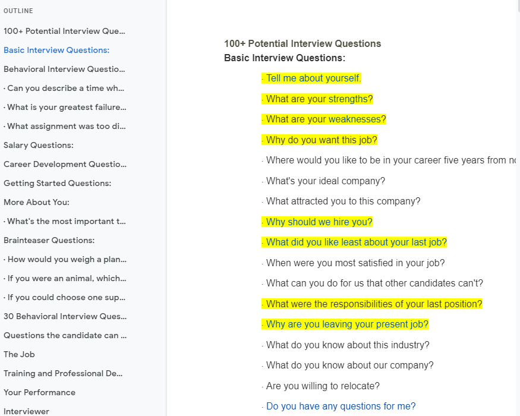

## General Interview Questions
:::info About the collection
This collection of interview questions were collected around the web.
problems and solutions in other pages. 
:::

[Potential Interview Questions](https://docs.google.com/document/d/1NrfuO4PIaQkOMmUqIdlFWpUHWshBsf3zOoq5fRKG1CU/edit)

## Basic Interview Questions

  Tell me about yourself.
- What are your strengths?
- What are your weaknesses?
- Why do you want this job?
- Where would you like to be in your career five years from now?
- What's your ideal company?
- What attracted you to this company?
- Why should we hire you?
- What did you like least about your last job?
- When were you most satisfied in your job?
- What can you do for us that other candidates can't? 
- What were the responsibilities of your last position?  
- Why are you leaving your present job?
- What do you know about this industry?  
- What do you know about our company? 
- Are you willing to relocate?  
- Do you have any questions for me?

## Behavioral Interview Questions:
- What was the last project you headed up, and what was its outcome? 
- Give me an example of a time that you felt you went above and beyond the call of duty at work. 
- Can you describe a time when your work was criticized? 
- Have you ever been on a team where someone was not pulling their own weight? How did you handle it? 
- Tell me about a time when you had to give someone difficult feedback. How did you handle it? 
- What is your greatest failure, and what did you learn from it? 
- What irritates you about other people, and how do you deal with it? 
- If I were your supervisor and asked you to do something that you disagreed with, what would you do?
- What was the most difficult period in your life, and how did you deal with it? 
- Give me an example of a time you did something wrong. How did you handle it? 
- What irritates you about other people, and how do you deal with it? 
- Tell me about a time where you had to deal with conflict on the job. 
- If you were at a business lunch and you ordered a rare steak and they brought it to you well done, what would you do? 
- If you found out your company was doing something against the law, like fraud, what would you do? 
- What assignment was too difficult for you, and how did you resolve the issue? 
- What's the most difficult decision you've made in the last two years and how did you come to that decision?
- Describe how you would handle a situation if you were required to finish multiple tasks by the end of the day, and there was no conceivable way that you could finish them. 

## Salary Questions:
- What salary are you seeking?
- What's your salary history?
- If I were to give you this salary you requested but let you write your job
description for the next year, what would it say?

## Career Development Questions:
- What are you looking for in terms of career development? 
- How do you want to improve yourself in the next year?
- What kind of goals would you have in mind if you got this job? 
- If I were to ask your last supervisor to provide you additional training or exposure, what would she suggest?

## Career Development Questions:

- What are you looking for in terms of career development? 
- How do you want to improve yourself in the next year?
- What kind of goals would you have in mind if you got this job? 
- If I were to ask your last supervisor to provide you additional training or
exposure, what would she suggest?

## Getting Started Questions:

- How would you go about establishing your credibility quickly with the team?
- How long will it take for you to make a significant contribution?
- What do you see yourself doing within the first 30 days of this job?
- If selected for this position, can you describe your strategy for the first 90 days?

## More About You:
·  How would you describe your work style? 
·  What would be your ideal working environment? 
·  What do you look for in terms of culture -- structured or entrepreneurial? 
·  Give examples of ideas you've had or implemented.
·  What techniques and tools do you use to keep yourself organized?   
·  If you had to choose one, would you consider yourself a big-picture person or a detail-oriented person?  
·  Tell me about your proudest achievement.  
·  Who was your favorite manager and why?  
·  What do you think of your previous boss? 
·  Was there a person in your career who really made a difference? 
·  What kind of personality do you work best with and why?  
·  What are you most proud of? 
·  What do you like to do?  
·  What are your lifelong dreams?  
·  What do you ultimately want to become? 
·  What is your personal mission statement?   
·  What are three positive things your last boss would say about you?  
·  What negative thing would your last boss say about you? 
·  What three character traits would your friends use to describe you? 
·  What are three positive character traits you don't have?  
·  If you were interviewing someone for this position, what traits would you look for?  
·  List five words that describe your character.   
·  Who has impacted you most in your career and how? 
·  What is your greatest fear? 
·  What is your biggest regret and why?   
·  What's the most important thing you learned in school? 
·  Why did you choose your major?  
·  What will you miss about your present/last job?  
·  What is your greatest achievement outside of work?  
·  What are the qualities of a good leader? A bad leader?  
·  Do you think a leader should be feared or liked?     
·  How do you feel about taking no for an answer?  
·  How would you feel about working for someone who knows less than you? 
·  How do you think I rate as an interviewer? 
·  Tell me one thing about yourself you wouldn't want me to know.  
·  Tell me the difference between good and exceptional.  
·  What kind of car do you drive? 
·  There's no right or wrong answer, but if you could be anywhere in the world right now, where would you be? 
·  What's the last book you read?  
·  What magazines do you subscribe to? 
·  What's the best movie you've seen in the last year?  
·  What would you do if you won the lottery? 
·  Who are your heroes?
·  What do you like to do for fun? 
·  What do you do in your spare time? 
·  What is your favorite memory from childhood? 

## Brainteaser Questions

·  How many times do a clock's hands overlap in a day?
·  How would you weigh a plane without scales?
·  Tell me 10 ways to use a pencil other than writing.
·  Sell me this pencil.
·  If you were an animal, which one would you want to be?
·  Why is there fuzz on a tennis ball?
·  If you could choose one superhero power, what would it be and why? 
·  If you could get rid of any one of the US states, which one would you get rid of and why? 
·  With your eyes closed, tell me step-by-step how to tie my shoes.

## 30 Behavioral Interview Questions You Should Be Ready to Answer

*By Lily Zhang
Interview prep 101 dictates that you should have your elevator pitch ready, a few stories polished, and a good sense of what you have to offer. So, how do you get there? Lots of practice, ideally aloud.
To help you better prepare for your next interview, here are 30 behavioral interview questions sorted by topic (in addition to 31 common interview questions here) that you can practice.
Not sure how to answer these questions? Here’s a quick guide on how to craft job-landing responses.*

### Teamwork
For questions like these, you want a story that illustrates your ability to work with others under challenging circumstances. Think team conflict, difficult project constraints, or clashing personalities.
- Talk about a time when you had to work closely with someone whose personality was very different from yours.
- Give me an example of a time you faced a conflict while working on a team. How did you handle that?
- Describe a time when you struggled to build a relationship with someone important. How did you eventually overcome that?
- We all make mistakes we wish we could take back. Tell me about a time you wish you’d handled a situation differently with a colleague.
- Tell me about a time you needed to get information from someone who wasn’t very responsive. What did you do?
 
### Client-Facing Skills
- If the role you’re interviewing for works with clients, definitely be ready for one of these. Find an example of a time where you successfully represented your company or team and delivered exceptional customer service.
- Describe a time when it was especially important to make a good impression on a client. How did you go about doing so?
- Give me an example of a time when you did not meet a client’s expectation. What happened, and how did you attempt to rectify the situation?
- Tell me about a time when you made sure a customer was pleased with your service.
- Describe a time when you had to interact with a difficult client. What was the situation, and how did you handle it?
- When you’re working with a large number of customers, it’s tricky to deliver excellent service to them all. How do you go about prioritizing your customers’ needs?
 
### Ability to Adapt
- Times of turmoil are finally good for something! Think of a recent work crisis you successfully navigated. Even if your navigation didn’t feel successful at the time, find a lesson or silver lining you took from the situation.
- Tell me about a time you were under a lot of pressure. What was going on, and how did you get through it?
- Describe a time when your team or company was undergoing some change. How did that impact you, and how did you adapt?
- Tell me about the first job you’ve ever had. What did you do to learn the ropes?
- Give me an example of a time when you had to think on your feet in order to delicately extricate yourself from a difficult or awkward situation.
- Tell me about a time you failed. How did you deal with this situation?
 
### Time Management Skills
- In other words, get ready to talk about a time you juggled multiple responsibilities, organized it all (perfectly), and completed everything before the deadline.
- Tell me about a time you had to be very strategic in order to meet all your top priorities.
- Describe a long-term project that you managed. How did you keep everything moving along in a timely manner?
- Sometimes it’s just not possible to get everything on your to-do list done. Tell me about a time your responsibilities got a little overwhelming. What did you do?
- Tell me about a time you set a goal for yourself. How did you go about ensuring that you would meet your objective?
- Give me an example of a time you managed numerous responsibilities. How did you handle that?
 
### Communication Skills
- You probably won’t have any trouble thinking of a story for communication questions, since it’s not only part of most jobs; it’s part of everyday life. However, the thing to remember here is to also talk about your thought process or preparation.
- Give me an example of a time when you were able to successfully persuade someone to see things your way at work.
- Describe a time when you were the resident technical expert. What did you do to make sure everyone was able to understand you?
- Tell me about a time when you had to rely on written communication to get your ideas across to your team.
- Give me an example of a time when you had to explain something fairly complex to a frustrated client. How did you handle this delicate situation?
- Tell me about a successful presentation you gave and why you think it was a hit.
 
### Motivation and Values
- A lot of seemingly random interview questions are actually attempts to learn more about what motivates you. Your response would ideally address this directly even if the question wasn’t explicit about it.
- Tell me about your proudest professional accomplishment.
- Describe a time when you saw some problem and took the initiative to correct it rather than waiting for someone else to do it.
- Tell me about a time when you worked under close supervision or extremely loose supervision. How did you handle that?
- Give me an example of a time you were able to be creative with your work. What was exciting or difficult about it?- ll me about a time you were dissatisfied in your work. 
- What could have been done to make it better?

## Questions the candidate can ask the Interviewer

1. What does a typical day look like?
2. What are the most immediate projects that need to be addressed?
3. Can you show me examples of projects I'd be working on?
4. What are the skills and experiences you’re looking for in an ideal candidate?
5. What attributes does someone need to have in order to be really successful in this position?
6. What types of skills is the team missing that you’re looking to fill with a new hire?
7. What are the biggest challenges that someone in this position would face?
8. What sort of budget would I be working with?
9. Is this a new role that has been created?
10. Do you expect the main responsibilities for this position to change in the next six months to a year?

### Training and Professional Development
*Think of each new job not just as a job, but as the next step on your path to career success. Will this position help you get there?*

11. How will I be trained?
12. What training programs are available to your employees?
13. Are there opportunities for advancement or professional development ?
14. Would I be able to represent the company at industry conferences?
15. Where is the last person who held this job moving on to?
16. Where have successful employees previously in this position progressed to?

